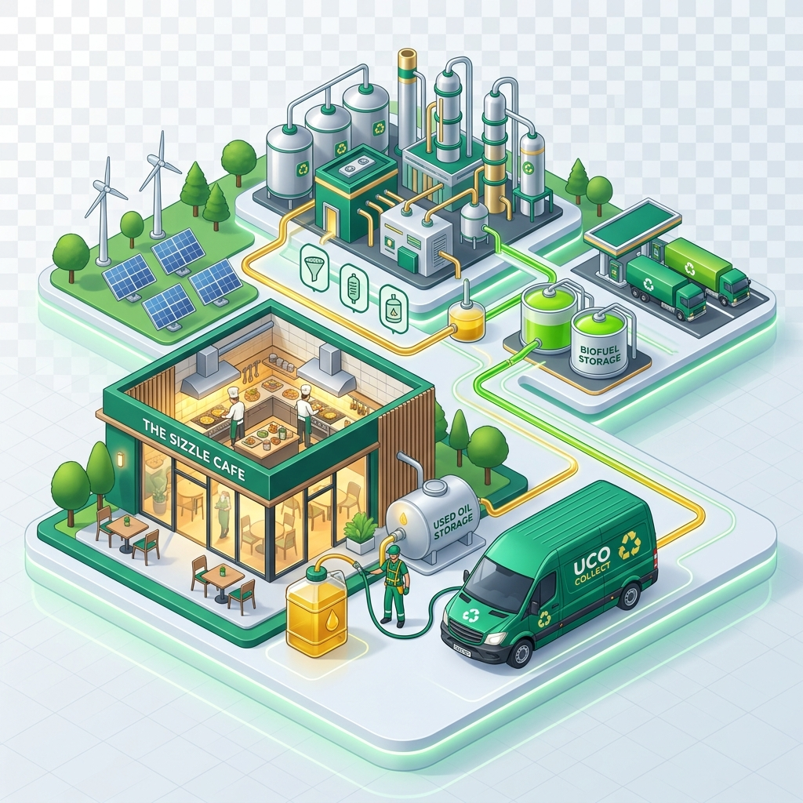

<div align="center">

# 🫙 BioCycle — Used Cooking Oil Collection Platform

### *Turning Kitchen Waste into Clean Energy*

[](https://biocycle.vercel.app)
[](https://react.dev)
[](https://vitejs.dev)
[](https://supabase.com)
[](LICENSE)

<br/>



<br/>

**BioCycle** is India's trusted Used Cooking Oil (UCO) collection network. We provide **free doorstep pickup** from restaurants, hotels, dhabas, cloud kitchens, and households — converting waste oil into certified **B20 biodiesel**.

[🚀 Live Demo](https://biocycle.vercel.app) · [📋 Features](#-features) · [⚡ Quick Start](#-quick-start) · [🏗️ Tech Stack](#️-tech-stack)

</div>

---

## 🌟 Features

| Feature | Description |
|---------|-------------|
| 📅 **Free Pickup Scheduling** | Book via form or WhatsApp — no app download needed |
| 🚛 **Pan-India Operations** | Active in 10+ cities with same-day response |
| 📋 **CPCB Certified** | Every operation meets Central Pollution Control Board standards |
| 🔍 **Full Traceability** | Track where your oil goes with blockchain-verified reports |
| 📊 **Carbon Credit Reports** | Verified certificates for CSR filings & ESG disclosures |
| 💬 **WhatsApp-First** | Schedule, track, and receive updates on WhatsApp |
| 🌿 **Environmental Impact** | 70,000+ litres collected, 175 tons CO₂ prevented |
| 📱 **Fully Responsive** | Premium UI that works beautifully on all devices |

## 🖼️ Screenshots

<div align="center">
<table>
<tr>
<td align="center"><strong>Hero Section</strong></td>
<td align="center"><strong>Process Flow</strong></td>
</tr>
<tr>
<td></td>
<td></td>
</tr>
</table>
</div>

## ⚡ Quick Start

```bash
# Clone the repository
git clone https://github.com/TANISHQGOYAL07/UCO.git

# Navigate to project
cd UCO

# Install dependencies
npm install

# Start development server
npm run dev
```

Open [http://localhost:5173](http://localhost:5173) in your browser.

## 🏗️ Tech Stack

<div align="center">

| Layer | Technology |
|-------|-----------|
| **Frontend** | React 19 + Vite 8 |
| **Styling** | Vanilla CSS (Custom Design System) |
| **Typography** | Google Fonts — Outfit + Inter |
| **Backend** | Supabase (PostgreSQL) |
| **Booking** | WhatsApp Business API Integration |
| **Hosting** | Vercel (Edge Network) |
| **Icons** | Lucide React |

</div>

## 📁 Project Structure

```
UCO/
├── public/
│   ├── favicon.svg
│   ├── hero-illustration.png
│   ├── process-illustration.png
│   └── schedule-illustration.png
├── src/
│   ├── components/
│   │   ├── Navbar.jsx          # Fixed navigation with scroll effect
│   │   ├── Hero.jsx            # Split hero with illustration
│   │   ├── Problem.jsx         # Environmental impact stats
│   │   ├── HowItWorks.jsx      # 5-step process card grid
│   │   ├── WhoWeServe.jsx      # Client categories
│   │   ├── WhyChooseUs.jsx     # Trust & features
│   │   ├── Impact.jsx          # Animated counter stats
│   │   ├── FAQ.jsx             # Accordion FAQ
│   │   ├── SchedulePickup.jsx  # Booking form → WhatsApp
│   │   ├── Footer.jsx          # Site footer
│   │   └── WhatsAppFloat.jsx   # Floating CTA button
│   ├── hooks/
│   │   ├── useInView.js        # Intersection Observer hook
│   │   └── useCounter.js       # Animated number counter
│   ├── App.jsx
│   ├── App.css
│   ├── index.css               # Design system & tokens
│   ├── main.jsx
│   └── supabaseClient.js
├── index.html
├── vite.config.js
└── package.json
```

## 🌍 Environmental Impact

<div align="center">

| Metric | Value |
|--------|-------|
| 🫙 UCO Collected | **70,000+ Litres** |
| 🌿 CO₂ Prevented | **196,000 kg** |
| 🤝 Partner Outlets | **500+** |
| 🌳 Trees Equivalent | **7,900+** |
| 🏙️ Cities Active | **10+** |

</div>

## 🤝 Contributing

Contributions are welcome! Feel free to open issues or submit pull requests.

1. Fork the repository
2. Create your feature branch (`git checkout -b feature/amazing-feature`)
3. Commit your changes (`git commit -m 'Add amazing feature'`)
4. Push to the branch (`git push origin feature/amazing-feature`)
5. Open a Pull Request

## 📄 License

This project is licensed under the MIT License.

---

<div align="center">

**Built with 💚 by [Tanishq Goyal](https://github.com/TANISHQGOYAL07)**

*Making the world cleaner, one pickup at a time.*

[](https://github.com/TANISHQGOYAL07/UCO)

</div>
